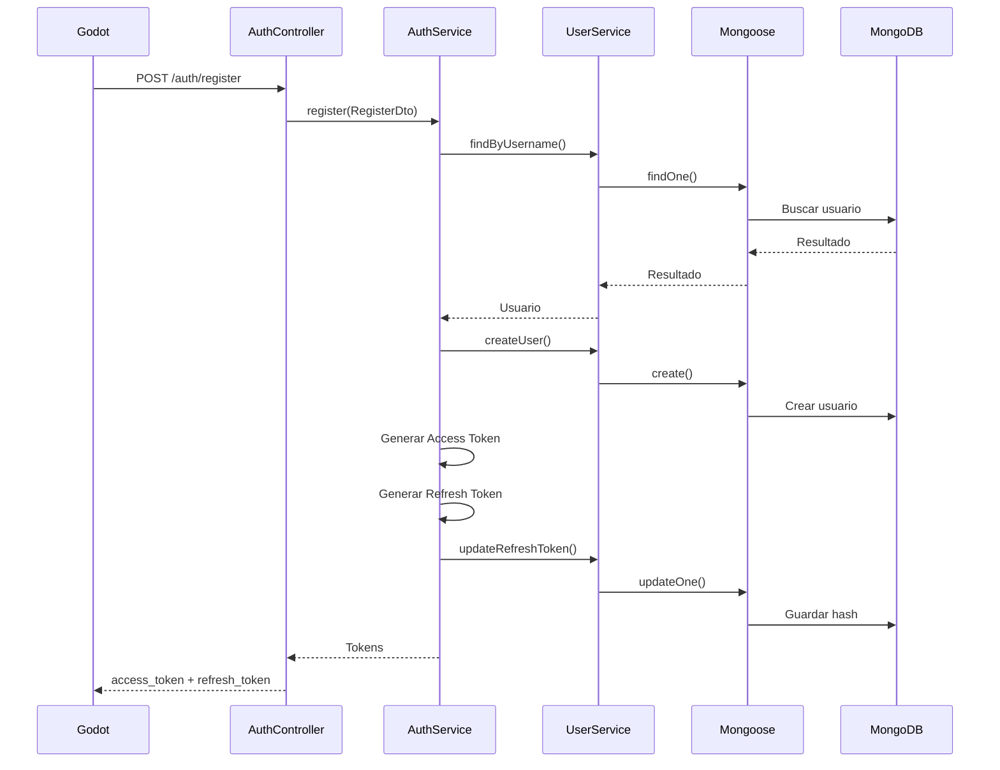
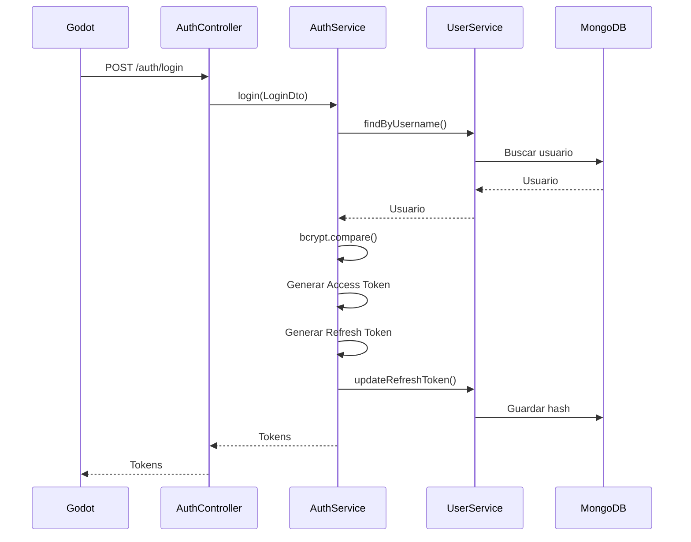
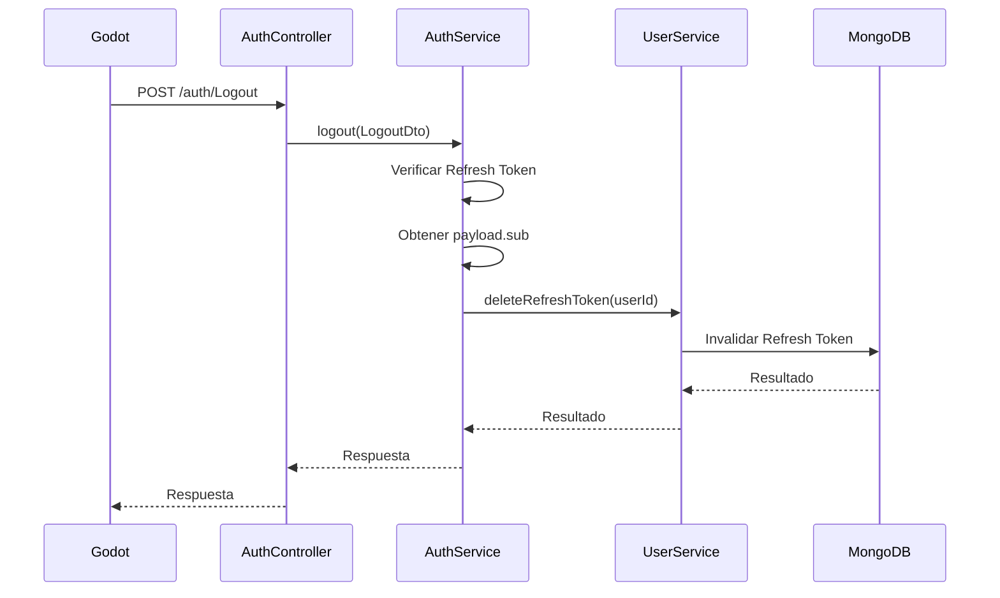

# CorralWars API

API REST del proyecto **CorralWars**, desarrollada con NestJS, TypeScript, MongoDB y Mongoose.

La API está diseñada para funcionar como backend de un videojuego desarrollado en Godot, encargándose de la autenticación, gestión de usuarios y persistencia de los datos del jugador.

---

# Descripción

CorralWars utiliza una arquitectura cliente-servidor:

```text
┌─────────────┐
│    Godot    │
│   Cliente   │
└──────┬──────┘
       │
       │ HTTP / JSON
       ▼
┌─────────────┐
│   NestJS    │
│     API     │
└──────┬──────┘
       │
       │ Mongoose
       ▼
┌─────────────┐
│   MongoDB   │
│  Base datos │
└─────────────┘
```

Para consultar la estructura completa de módulos, responsabilidades y dependencias:

[Ver documentación de arquitectura](./docs/architecture.md)

---

# Configuración

## Variables de entorno

El proyecto utiliza variables de entorno para configurar el servidor, la conexión con MongoDB y las claves utilizadas por JWT.

Crear un archivo `.env` en la raíz del proyecto:

```env
PORT=3500

MONGODB_URI=<tu_uri_de_mongodb>

JWT_SECRET=<tu_access_token_secret>

JWT_REFRESH_SECRET=<tu_refresh_token_secret>

NODE_ENV=DEV
```

| Variable             | Descripción                                  |
| -------------------- | -------------------------------------------- |
| `PORT`               | Puerto donde se ejecutará la API             |
| `MONGODB_URI`        | URI de conexión a MongoDB                    |
| `JWT_SECRET`         | Secreto utilizado para firmar Access Tokens  |
| `JWT_REFRESH_SECRET` | Secreto utilizado para firmar Refresh Tokens |
| `NODE_ENV`           | Determina el entorno de ejecución            |

> El archivo `.env` contiene información sensible y no debe subirse al repositorio.

---

# Instalación

## Clonar el repositorio

```bash
git clone <URL_DEL_REPOSITORIO>
```

## Entrar al proyecto

```bash
cd CorralWars
```

## Instalar las dependencias

```bash
npm install
```

Después de instalar las dependencias, configura las variables de entorno en el archivo `.env`.

---

# Ejecución

## Desarrollo

Para iniciar el servidor en modo desarrollo:

```bash
npm run start:dev
```

La API estará disponible en:

```text
http://localhost:3500
```

---

# Swagger

Durante el desarrollo, Swagger se habilita cuando la variable:

```env
NODE_ENV=DEV
```

está configurada.

La documentación estará disponible en:

```text
http://localhost:3500/api
```

Swagger permite visualizar los endpoints disponibles y probar las solicitudes directamente desde la interfaz.

La especificación OpenAPI también está disponible en:

```text
http://localhost:3500/api-json
```

---

# API

La API está organizada mediante diferentes módulos.

Actualmente cuenta con los siguientes endpoints:

| Método | Endpoint                  | Descripción          |
| ------ | ------------------------- | -------------------- |
| `GET`  | `/`                       | Endpoint de prueba   |
| `POST` | `/auth/register`          | Registrar una cuenta |
| `POST` | `/auth/login`             | Iniciar sesión       |
| `POST` | `/auth/Logout`            | Cerrar sesión        |
| `GET`  | `/user/findOne/:username` | Buscar un usuario    |

---

# Auth

El módulo `AuthModule` contiene la lógica relacionada con la autenticación de los jugadores.

Los endpoints utilizan el prefijo:

```text
/auth
```

---

## Registrar una cuenta

```http
POST /auth/register
```

Registra un nuevo usuario y genera sus tokens de autenticación.

### Request

```json
{
  "username": "Yair17",
  "password": "1234567890",
  "confirm_password": "1234567890"
}
```

### Parámetros

| Campo              | Tipo     | Requerido | Descripción                   |
| ------------------ | -------- | --------- | ----------------------------- |
| `username`         | `string` | Sí        | Nombre de usuario             |
| `password`         | `string` | Sí        | Contraseña                    |
| `confirm_password` | `string` | Sí        | Confirmación de la contraseña |

### Restricciones

- `username` debe tener como mínimo 5 caracteres.
- `password` debe tener como mínimo 10 caracteres.
- `confirm_password` debe coincidir con `password`.

### Respuesta

```json
{
  "access_token": "eyJ...",
  "refresh_token": "eyJ..."
}
```

El `access_token` se utilizará para realizar solicitudes autenticadas.

El `refresh_token` se utilizará para mantener la sesión y renovar el Access Token cuando sea necesario.

### Errores

#### 401 Unauthorized

Puede ocurrir cuando:

- El nombre de usuario ya está registrado.
- Las contraseñas no coinciden.

---

# Iniciar sesión

```http
POST /auth/login
```

Autentica un usuario existente.

### Request

```json
{
  "username": "Yair17",
  "password": "1234567890"
}
```

### Respuesta

```json
{
  "access_token": "eyJ...",
  "refresh_token": "eyJ..."
}
```

### Proceso interno

Cuando se recibe una solicitud de login:

```text
Cliente
   │
   │ username + password
   ▼
AuthController
   │
   ▼
AuthService
   │
   ▼
UserService
   │
   ▼
MongoDB
```

El servidor:

1. Busca el usuario mediante su nombre.
2. Comprueba que el usuario exista.
3. Compara la contraseña recibida con el hash almacenado.
4. Genera un Access Token.
5. Genera un Refresh Token.
6. Almacena el Refresh Token hasheado.
7. Devuelve ambos tokens al cliente.

La contraseña se verifica mediante `bcrypt`.

### Errores

```http
401 Unauthorized
```

Cuando las credenciales no son correctas.

La API utiliza el mismo mensaje tanto si el usuario no existe como si la contraseña es incorrecta:

```text
Usuario o contraseña incorrectos
```

---

# Cerrar sesión

```http
POST /auth/Logout
```

Cierra la sesión del usuario utilizando su Refresh Token.

### Request

```json
{
  "refresh_token": "eyJ..."
}
```

### Proceso

El servidor:

1. Recibe el Refresh Token.
2. Verifica el token utilizando `JWT_REFRESH_SECRET`.
3. Obtiene el ID del usuario desde `payload.sub`.
4. Busca la cuenta correspondiente.
5. Invalida el Refresh Token almacenado.

### Error

```http
401 Unauthorized
```

Puede ocurrir si el Refresh Token es inválido o está expirado.

---

# User

El módulo `UserModule` se encarga de gestionar los usuarios y sus datos almacenados en MongoDB.

Los endpoints utilizan el prefijo:

```text
/user
```

---

## Buscar usuario

```http
GET /user/findOne/:username
```

Busca un usuario utilizando su nombre de usuario.

### Ejemplo

```http
GET /user/findOne/Yair17
```

### Parámetros

| Parámetro  | Tipo     | Descripción                            |
| ---------- | -------- | -------------------------------------- |
| `username` | `string` | Nombre del usuario que se desea buscar |

### Ejemplo de solicitud

```http
GET http://localhost:3500/user/findOne/Yair17
```

El `UserController` recibe el nombre de usuario y delega la búsqueda a:

```text
UserController
      │
      ▼
 UserService
      │
      ▼
 UserModel
      │
      ▼
  MongoDB
```

---

# Autenticación

CorralWars utiliza **JSON Web Tokens (JWT)** para manejar las sesiones.

Se utilizan dos tipos de tokens:

```text
Access Token
Refresh Token
```

Cada uno tiene una función y duración diferente.

---

## Access Token

El Access Token se utiliza para autenticar las solicitudes que requieren una sesión activa.

Tiene una duración de:

```text
15 minutos
```

Contiene información básica del usuario:

```json
{
  "sub": "ID_DEL_USUARIO",
  "username": "Yair17"
}
```

Para realizar una solicitud autenticada, el cliente debe enviar el token mediante el header:

```http
Access-Token: eyJ...
```

---

## AuthGuard

Las rutas que necesiten autenticación pueden utilizar el `AuthGuard`.

El guard obtiene el token desde:

```http
Access-Token
```

Después lo verifica utilizando `JwtService`.

Si el token es válido:

```text
request.user = payload
```

y la solicitud puede continuar.

Si el token no existe:

```http
401 Unauthorized
```

con el mensaje:

```text
Access token requerido
```

Si el token es inválido o expiró:

```http
401 Unauthorized
```

con el mensaje:

```text
Access token inválido
```

---

# Refresh Token

El Refresh Token se utiliza para mantener la sesión del usuario cuando el Access Token ha expirado.

Tiene una duración de:

```text
7 días
```

A diferencia del Access Token, utiliza una clave secreta independiente:

```env
JWT_REFRESH_SECRET=<tu_refresh_jwt_secret>
```

Su payload contiene el ID del usuario:

```json
{
  "sub": "ID_DEL_USUARIO"
}
```

---

# Almacenamiento del Refresh Token

El Refresh Token no se almacena directamente en MongoDB.

Antes de guardarlo, se genera un hash utilizando `bcrypt`.

```text
Refresh Token
      │
      ▼
bcrypt.hash()
      │
      ▼
    Hash
      │
      ▼
  MongoDB
```

De esta manera, MongoDB no necesita almacenar el token original.

---

# Flujo de autenticación

## Registro



---

## Login



---

## Logout



---

# Flujo de renovación de sesión

El cliente puede utilizar el Refresh Token cuando el Access Token haya expirado.

El flujo esperado es:

```text
Cliente
   │
   │ Request con Access Token
   ▼
NestJS
   │
   ├── Token válido ─────────► Procesar solicitud
   │
   └── Token inválido
             │
             ▼
            401
             │
             ▼
      Enviar Refresh Token
             │
             ▼
      Verificar Refresh Token
             │
        ┌────┴────┐
        │         │
      válido    inválido
        │         │
        ▼         ▼
Nuevo Access    Volver a
Token           iniciar sesión
        │
        ▼
Reintentar solicitud
```

---

# Base de datos

La API utiliza MongoDB como base de datos no relacional.

Mongoose se utiliza como ODM para trabajar con MongoDB desde NestJS.

La conexión se establece mediante:

```ts
MongooseModule.forRoot(process.env.MONGODB_URI);
```

Los modelos específicos se registran dentro de sus módulos mediante:

```ts
MongooseModule.forFeature();
```

Para consultar la estructura y documentación de la base de datos:

[Ver documentación de la base de datos](./docs/database.md)

---

# Modelo User

Actualmente el usuario contiene los siguientes campos:

```text
User
├── _id
├── username
├── password
├── refresh_token
├── position
├── inventory
├── level
├── experience
└── defatedNeighbors
```

| Campo              | Tipo        | Descripción                        |
| ------------------ | ----------- | ---------------------------------- |
| `_id`              | `ObjectId`  | Identificador generado por MongoDB |
| `username`         | `string`    | Nombre del usuario                 |
| `password`         | `string`    | Hash de la contraseña              |
| `refresh_token`    | `string`    | Hash del Refresh Token             |
| `position`         | `Position`  | Posición del jugador               |
| `inventory`        | `Inventory` | Inventario del jugador             |
| `level`            | `number`    | Nivel actual                       |
| `experience`       | `number`    | Experiencia acumulada              |
| `defatedNeighbors` | `string[]`  | Vecinos derrotados                 |

---

# Position

`Position` es un subdocumento utilizado para almacenar la posición del jugador.

```json
{
  "x": 0,
  "y": 0
}
```

Campos:

| Campo | Tipo     |
| ----- | -------- |
| `x`   | `number` |
| `y`   | `number` |

Los valores iniciales son:

```text
x = 0
y = 0
```

`Position` es un subdocumento de MongoDB sin `_id` propio.

---

# Inventory

El inventario utiliza una estructura de slots.

Actualmente se crea con:

```text
width = 7
height = 5
```

Por lo tanto:

```text
7 × 5 = 35 slots
```

Cada slot contiene:

```json
{
  "itemId": null,
  "quantity": 0
}
```

---

# InventorySlot

| Campo      | Tipo             | Descripción              |
| ---------- | ---------------- | ------------------------ |
| `itemId`   | `string \| null` | ID del objeto almacenado |
| `quantity` | `number`         | Cantidad del objeto      |

`quantity` no puede tener un valor negativo.

---

# Creación de usuarios

Cuando se crea un usuario, el backend genera automáticamente algunos datos iniciales.

```text
username
password
position
inventory
refresh_token
```

Los valores iniciales principales son:

```text
position:
    x = 0
    y = 0

inventory:
    width = 7
    height = 5
    slots = 35

level:
    1

experience:
    0
```

La contraseña se almacena mediante un hash generado con bcrypt.

---

# DTOs

Los DTOs se utilizan para definir y validar los datos recibidos por la API.

Actualmente existen DTOs relacionados con autenticación y usuarios.

## Auth DTOs

```text
auth/dto/
├── Login.dto.ts
├── Logout.dto.ts
└── Register.dto.ts
```

## User DTOs

```text
user/dto/
├── createUser.dto.ts
├── refreshToken.dto.ts
└── update-user.dto.ts
```

---

# Configuración de módulos

## ConfigModule

Las variables de entorno son cargadas mediante:

```ts
ConfigModule.forRoot({
  isGlobal: true,
});
```

Al utilizar `isGlobal: true`, el `ConfigModule` puede utilizarse desde otros módulos sin necesidad de importarlo repetidamente.

---

# JWT Module

`AuthModule` registra `JwtModule` utilizando `registerAsync()` y `ConfigService`.

Esto permite obtener el secreto desde las variables de entorno:

```env
JWT_SECRET=<tu_access_token_secret>
```

Los Refresh Tokens utilizan:

```env
JWT_REFRESH_SECRET=<tu_refresh_token_secret>
```

---

# Comunicación con Godot

La API está diseñada para que el cliente del videojuego pueda comunicarse mediante HTTP.

Por ejemplo:

```text
Godot
   │
   │ HTTP Request
   ▼
CorralWars API
   │
   ▼
MongoDB
```

Una solicitud autenticada puede tener la siguiente estructura:

```http
GET /ruta/protegida
Content-Type: application/json
Access-Token: eyJ...
```

El cliente puede almacenar:

```text
access_token
refresh_token
```

y utilizarlos durante la sesión.

---

# Seguridad

## Contraseñas

Las contraseñas no se almacenan en texto plano.

Se utiliza:

```text
bcrypt.hash()
```

para generar el hash.

Durante el login se utiliza:

```text
bcrypt.compare()
```

para comprobar la contraseña.

---

## JWT Secrets

Los secretos utilizados por JWT deben mantenerse fuera del código fuente.

```env
JWT_SECRET=<secret>
JWT_REFRESH_SECRET=<secret>
```

El archivo `.env` no debe subirse al repositorio.

---

## Datos sensibles

Nunca se deben incluir en Git:

```text
.env
```

ni:

- Claves JWT.
- Contraseñas.
- Credenciales de MongoDB.
- Tokens.
- Cualquier otra información sensible.

---

# Estructura completa

```text
src/
│
├── auth/
├── user/
├── inventory/
├── items/
├── recipes/
├── world-objects/
├── common/
│
├── app.controller.ts
├── app.module.ts
├── app.service.ts
└── main.ts
```

Para consultar el detalle de cada módulo y sus relaciones:

[Ver arquitectura del proyecto](./docs/architecture.md)

---

# Estado actual

Actualmente la API cuenta con:

- Conexión a MongoDB.
- Mongoose.
- Registro de usuarios.
- Login.
- Logout.
- Access Tokens.
- Refresh Tokens.
- Hashing de contraseñas con bcrypt.
- Hashing de Refresh Tokens.
- AuthGuard para Access Tokens.
- Gestión de usuarios.
- Inventario inicial.
- Posición inicial del jugador.
- Sistema de nivel y experiencia.
- Swagger / OpenAPI.
- Validación mediante DTOs.

La comunicación principal está preparada para:

```text
Godot → HTTP → NestJS → Mongoose → MongoDB
```

---

# Desarrollo futuro

La arquitectura permite agregar nuevos módulos sin mezclar sus responsabilidades con la autenticación.

Por ejemplo:

```text
src/
├── auth/
├── user/
├── inventory/
├── items/
├── recipes/
├── world-objects/
├── neighbors/
├── pets/
├── quests/
└── ...
```

Cada módulo puede contener sus propios:

```text
Controller
Service
DTOs
Schemas
```

Esto permite ampliar la API a medida que se agreguen nuevas funcionalidades al videojuego.

---

# Documentación relacionada

- [Arquitectura](./docs/architecture.md)
- [Base de datos](./docs/database.md)

---

# Licencia

Este proyecto pertenece a **CorralWars**.
