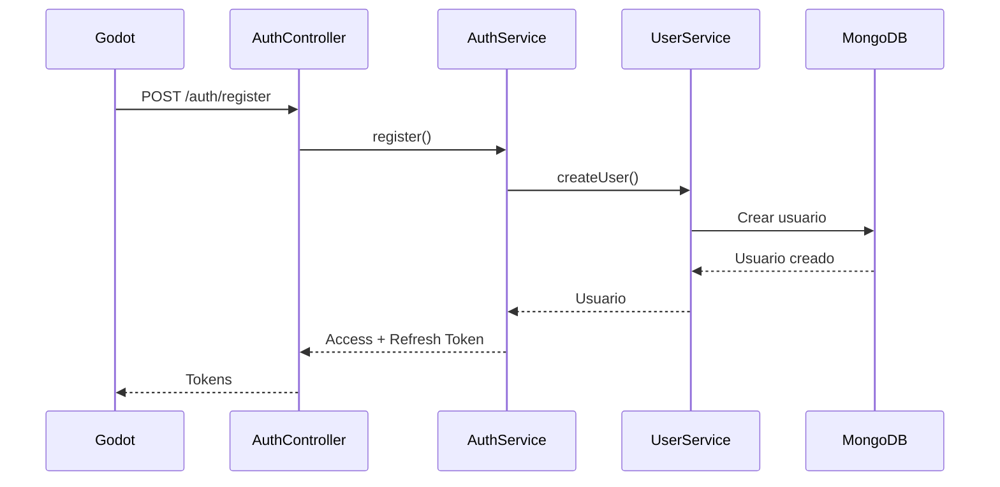
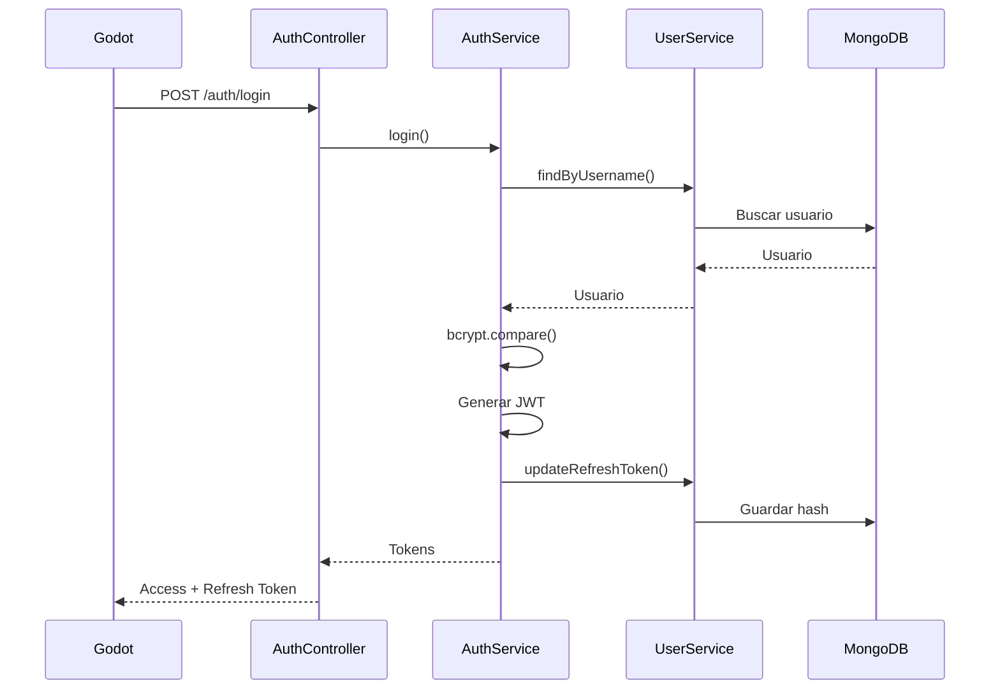
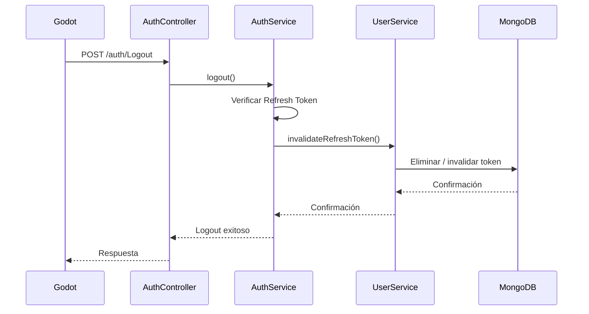
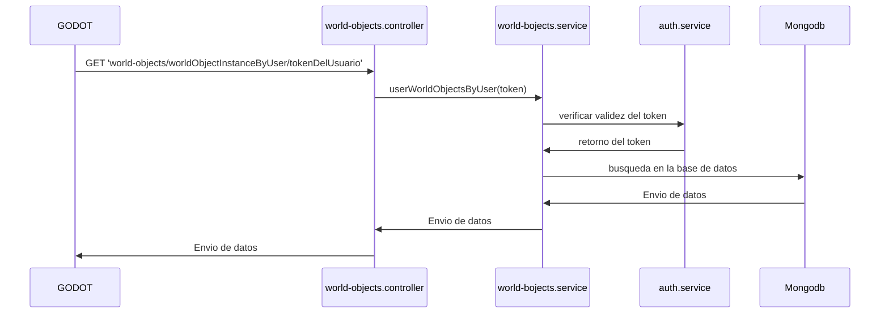
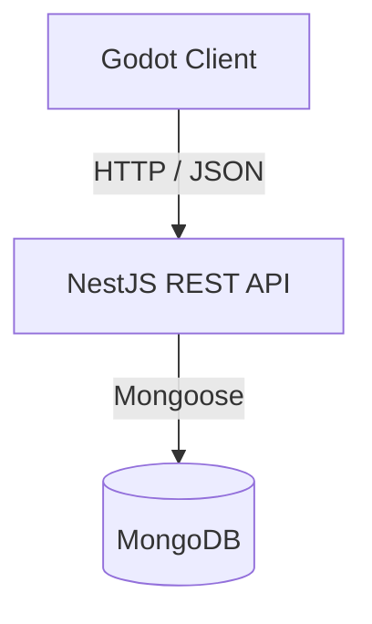
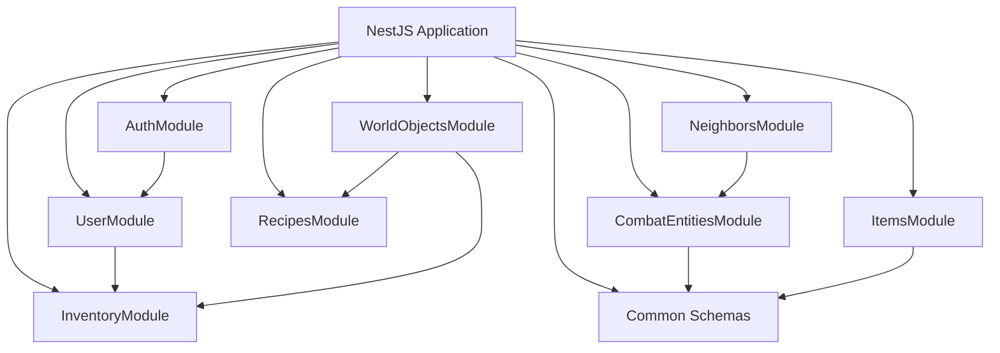
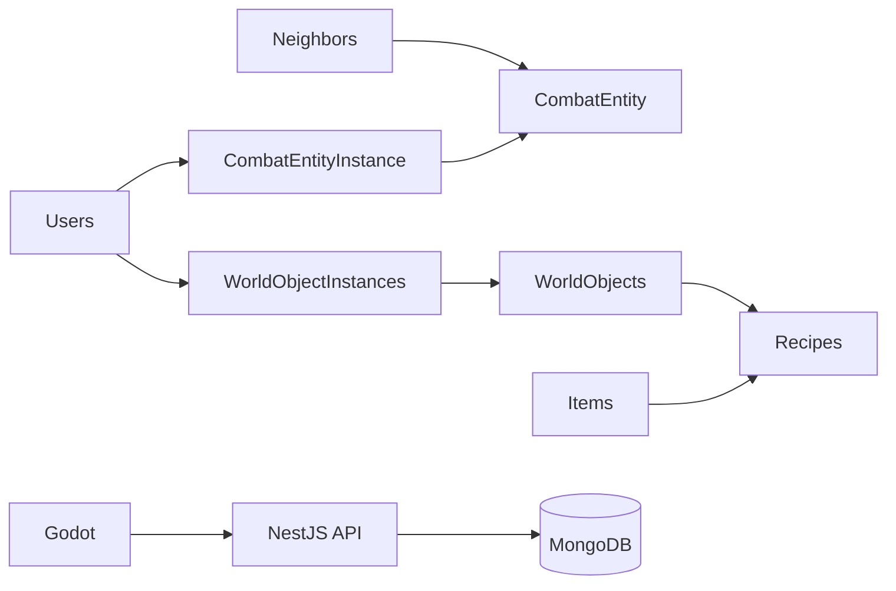

# CorralWars API

API REST del proyecto **CorralWars**, desarrollada con NestJS, TypeScript, MongoDB y Mongoose.

La API funciona como backend del videojuego desarrollado en Godot y se encarga principalmente de la autenticación, gestión de usuarios, persistencia y administración de los datos que necesitan mantenerse entre sesiones.

---

# Arquitectura

CorralWars utiliza una arquitectura cliente-servidor:

```text
┌─────────────┐
│    Godot    │
│   Cliente   │
└──────┬──────┘
       │
       │ HTTP / JSON
       ▼
┌─────────────┐
│   NestJS    │
│     API     │
└──────┬──────┘
       │
       │ Mongoose
       ▼
┌─────────────┐
│   MongoDB   │
│  Base datos │
└─────────────┘
```

Godot actúa como cliente del videojuego.

NestJS proporciona la API REST y contiene la lógica de aplicación.

MongoDB almacena la información que necesita persistencia.

Para consultar la arquitectura completa:

[Ver documentación de arquitectura](./docs/architecture.md)

Para consultar la estructura de la base de datos:

[Ver documentación de la base de datos](./docs/database.md)

---

# Tecnologías

- NestJS
- TypeScript
- MongoDB
- Mongoose
- JWT
- bcrypt
- Swagger / OpenAPI
- class-validator
- Godot

---

# Estructura del proyecto

```text
src/
│
├── auth/
│
├── combat-entities/
│   ├── combat-entities.controller.ts
│   ├── combat-entities.module.ts
│   ├── combat-entities.service.ts
│   └── schemas/
│       ├── combatEntity.schema.ts
│       ├── combatEntityInstance.schema.ts
│       └── stat.schema.ts
│
├── common/
│   └── schemas/
│       ├── effect.schema.ts
│       └── position.schema.ts
│
├── inventory/
│
├── items/
│
├── neighbors/
│
├── recipes/
│
├── user/
│
├── world-objects/
│
├── app.controller.ts
├── app.module.ts
├── app.service.ts
└── main.ts
```

Los módulos principales representan diferentes dominios del juego.

---

# Configuración

## Variables de entorno

Crear un archivo `.env` en la raíz del proyecto:

```env
PORT=3500

MONGODB_URI=<tu_uri_de_mongodb>

JWT_SECRET=<tu_access_token_secret>

JWT_REFRESH_SECRET=<tu_refresh_token_secret>

NODE_ENV=DEV
```

| Variable             | Descripción                                   |
| -------------------- | --------------------------------------------- |
| `PORT`               | Puerto donde se ejecutará la API.             |
| `MONGODB_URI`        | URI de conexión a MongoDB.                    |
| `JWT_SECRET`         | Secreto utilizado para firmar Access Tokens.  |
| `JWT_REFRESH_SECRET` | Secreto utilizado para firmar Refresh Tokens. |
| `NODE_ENV`           | Entorno de ejecución.                         |

El archivo `.env` contiene información sensible y no debe subirse al repositorio.

---

# Instalación

## Clonar el repositorio

```bash
git clone <URL_DEL_REPOSITORIO>
```

## Entrar al proyecto

```bash
cd CorralWars
```

## Instalar dependencias

```bash
npm install
```

Después de instalar las dependencias, configura las variables de entorno.

---

# Ejecución

## Desarrollo

Para iniciar el servidor en modo desarrollo:

```bash
npm run start:dev
```

La API estará disponible en:

```text
http://localhost:3500
```

---

# Swagger

Durante el desarrollo, Swagger se habilita cuando:

```env
NODE_ENV=DEV
```

está configurado.

La documentación estará disponible en:

```text
http://localhost:3500/api
```

La especificación OpenAPI está disponible en:

```text
http://localhost:3500/api-json
```

Swagger permite consultar los endpoints disponibles y realizar pruebas directamente desde la interfaz.

---

# API

Actualmente existen endpoints relacionados principalmente con autenticación y usuarios.

| Método | Endpoint                  | Descripción           |
| ------ | ------------------------- | --------------------- |
| `GET`  | `/`                       | Endpoint de prueba.   |
| `POST` | `/auth/register`          | Registrar una cuenta. |
| `POST` | `/auth/login`             | Iniciar sesión.       |
| `POST` | `/auth/Logout`            | Cerrar sesión.        |
| `GET`  | `/user/findOne/:username` | Buscar un usuario.    |

La API seguirá creciendo conforme se implementen los diferentes módulos del videojuego.

---

# Auth

El módulo de autenticación utiliza el prefijo:

```text
/auth
```

Actualmente proporciona:

```text
POST /auth/register
POST /auth/login
POST /auth/Logout
```

---

# Registro

```http
POST /auth/register
```

Registra un nuevo usuario.

### Request

```json
{
  "username": "Yair17",
  "password": "1234567890",
  "confirm_password": "1234567890"
}
```

### Parámetros

| Campo              | Tipo     | Requerido | Descripción                 |
| ------------------ | -------- | --------: | --------------------------- |
| `username`         | `string` |        Sí | Nombre del usuario.         |
| `password`         | `string` |        Sí | Contraseña.                 |
| `confirm_password` | `string` |        Sí | Confirmación de contraseña. |

### Restricciones

- `username` debe tener al menos 5 caracteres.
- `password` debe tener al menos 10 caracteres.
- `confirm_password` debe coincidir con `password`.

### Respuesta

```json
{
  "access_token": "eyJ...",
  "refresh_token": "eyJ..."
}
```

La contraseña se almacena mediante un hash generado con `bcrypt`.

### Flujo de registro



---

# Login

```http
POST /auth/login
```

Autentica un usuario existente.

### Request

```json
{
  "username": "Yair17",
  "password": "1234567890"
}
```

### Respuesta

```json
{
  "access_token": "eyJ...",
  "refresh_token": "eyJ..."
}
```

### Flujo

```text
Godot
   │
   │ username + password
   ▼
AuthController
   │
   ▼
AuthService
   │
   ▼
UserService
   │
   ▼
MongoDB
```

También puede representarse mediante:



El servidor:

1. Busca el usuario.
2. Comprueba que exista.
3. Compara la contraseña con el hash.
4. Genera el Access Token.
5. Genera el Refresh Token.
6. Almacena el hash del Refresh Token.
7. Devuelve los tokens.

La contraseña se verifica mediante:

```text
bcrypt.compare()
```

---

# Logout

```http
POST /auth/Logout
```

Cierra la sesión del usuario mediante su Refresh Token.

### Request

```json
{
  "refresh_token": "eyJ..."
}
```

El servidor:

1. Verifica el Refresh Token.
2. Obtiene el ID del usuario.
3. Busca la cuenta correspondiente.
4. Invalida el Refresh Token almacenado.

### Flujo



---

# Autenticación

CorralWars utiliza **JSON Web Tokens (JWT)**.

Se utilizan dos tokens:

```text
Access Token
Refresh Token
```

---

# Access Token

El Access Token se utiliza para autenticar solicitudes que requieren una sesión activa.

Actualmente tiene una duración de:

```text
15 minutos
```

Su payload contiene información básica del usuario:

```json
{
  "sub": "ID_DEL_USUARIO",
  "username": "Yair17"
}
```

---

# AuthGuard

Las rutas protegidas utilizan el guard:

```text
src/auth/guards/access_token_auth.guard.ts
```

El guard verifica el Access Token.

Si es válido:

```text
request.user = payload
```

y la solicitud continúa.

Si el token no existe:

```http
401 Unauthorized
```

Si el token es inválido o expiró:

```http
401 Unauthorized
```

---

# Refresh Token

El Refresh Token permite mantener la sesión del usuario cuando el Access Token expira.

Tiene una duración de:

```text
7 días
```

Utiliza una clave independiente:

```env
JWT_REFRESH_SECRET=<tu_refresh_jwt_secret>
```

Su payload contiene el ID del usuario:

```json
{
  "sub": "ID_DEL_USUARIO"
}
```

---

# Almacenamiento del Refresh Token

El Refresh Token original no se almacena directamente.

Primero se genera un hash mediante `bcrypt`:

```text
Refresh Token
      │
      ▼
bcrypt.hash()
      │
      ▼
    Hash
      │
      ▼
  MongoDB
```

Esto evita almacenar directamente el token original en la base de datos.

---

# User

El módulo `UserModule` administra las cuentas y datos persistentes del jugador.

El prefijo actual es:

```text
/user
```

## Buscar usuario

```http
GET /user/findOne/:username
```

Ejemplo:

```http
GET /user/findOne/Yair17
```

Flujo:

```text
UserController
      │
      ▼
 UserService
      │
      ▼
 UserModel
      │
      ▼
 MongoDB
```

---

# Datos persistentes del jugador

El usuario almacena información relacionada con su progreso general.

Conceptualmente:

```text
User
├── _id
├── username
├── password
├── refresh_token
├── coins
├── position
├── inventory
└── defatedNeighbors[]
```

Los datos de progresión específica de una entidad de combate no se almacenan directamente en `User`.

En su lugar se utilizan:

```text
CombatEntityInstance
```

Esto permite que cada entidad tenga su propia progresión.

---

# Inventory

El inventario utiliza una estructura basada en slots.

Configuración actual:

```text
width  = 7
height = 5
```

Por lo tanto:

```text
7 × 5 = 35 slots
```

Cada slot comienza como:

```json
{
  "itemId": null,
  "quantity": 0
}
```

Los Items se identifican mediante su `_id`.

```text
InventorySlot.itemId
        │
        ▼
     Item._id
```

---

# Items

Los Items representan las definiciones de objetos disponibles dentro del juego.

```text
Item
├── name
├── type
└── effects[]
```

Los efectos utilizan el schema común:

```text
src/common/schemas/effect.schema.ts
```

Por lo tanto, `Effect` puede utilizarse en más de un dominio.

---

# Recipes

Las recetas definen los objetos necesarios para fabricar un resultado.

```text
Recipe
├── inputs[]
│   ├── itemId
│   ├── slot
│   └── quantity
│
└── outPut
    ├── itemId
    └── quantity
```

Las recetas utilizan identificadores de `Item`.

---

# World Objects

El sistema de objetos del mundo separa:

```text
WorldObject
WorldObjectInstance
```

`WorldObject` representa una definición.

`WorldObjectInstance` representa una instancia concreta asociada a un usuario.

```text
WorldObject
    │
    ├── Instance → Usuario A
    ├── Instance → Usuario B
    └── Instance → Usuario C
```

Una instancia puede almacenar:

```text
userId
worldObjectId
position
inventory
```

### Flujo de busqueda de worldobjectinstance por usuario



---

# Neighbors

Los vecinos se administran mediante:

```text
src/neighbors/
```

La estructura principal relaciona al vecino con una `CombatEntity`:

```text
Neighbor
├── name
├── level
├── combatEntityId
└── combatEntityAppearsAsPetInNeighborhood
```

La relación es:

```text
Neighbor
     │
     │ combatEntityId
     ▼
CombatEntity
```

No existe una colección `Pet` independiente para representar esta relación.

Una `CombatEntity` puede representar una mascota, un vecino, un jefe u otra entidad combatible.

---

# Combat Entities

El sistema de combate se encuentra en:

```text
src/combat-entities/
```

Su estructura es:

```text
combat-entities/
├── combat-entities.controller.ts
├── combat-entities.module.ts
├── combat-entities.service.ts
└── schemas/
    ├── combatEntity.schema.ts
    ├── combatEntityInstance.schema.ts
    └── stat.schema.ts
```

El sistema separa:

```text
CombatEntity
CombatEntityInstance
```

---

# CombatEntity

`CombatEntity` representa la definición general de una entidad combatible.

Puede representar:

```text
Mascota
Vecino
Jefe
Otra entidad combatible
```

La definición contiene datos que no dependen de un usuario:

```text
CombatEntity
├── name
├── xpMultiplier
├── sceneId
├── baseStats
└── specialAttacks[]
```

---

# CombatEntityStats

`CombatEntityStats` contiene las estadísticas base de una `CombatEntity`.

```text
CombatEntityStats
├── health
├── attack
├── defense
├── velocity
├── stamina
└── specialChance
```

Restricciones actuales:

| Estadística     | Mínimo |
| --------------- | -----: |
| `health`        |   1000 |
| `attack`        |     10 |
| `defense`       |      0 |
| `velocity`      |    300 |
| `stamina`       |     30 |
| `specialChance` |    0.2 |

Estas estadísticas pertenecen a la definición de la entidad.

Por ejemplo:

```text
CombatEntity
└── baseStats
    ├── health
    ├── attack
    ├── defense
    ├── velocity
    ├── stamina
    └── specialChance
```

---

# SpecialAttackStats

Los ataques especiales pueden utilizar estadísticas específicas para modificar su comportamiento.

Actualmente `SpecialAttackStats` contiene:

```text
SpecialAttackStats
├── velocityMultiply
└── attackMultiply
```

Estos valores permiten modificar características como la velocidad y el ataque durante la ejecución de un ataque especial.

Los ataques especiales también pueden utilizar:

```text
effects[]
```

Estos efectos utilizan el schema común:

```text
src/common/schemas/effect.schema.ts
```

---

# CombatEntityInstance

`CombatEntityInstance` representa una instancia concreta de una `CombatEntity` perteneciente a un usuario.

```text
CombatEntityInstance
├── userId
├── combatEntityId
├── combatEntityStats
├── statPoints
├── experience
└── level
```

La relación es:

```text
User
 │
 ▼
CombatEntityInstance
 │
 │ combatEntityId
 ▼
CombatEntity
```

Esto permite que diferentes usuarios tengan la misma `CombatEntity`, pero con diferentes niveles, experiencia y estadísticas.

---

# CombatEntityInstanceStats

Las estadísticas de una instancia son independientes de las estadísticas base de la entidad.

```text
CombatEntityInstanceStats
├── health
├── attack
├── defense
├── velocity
└── stamina
```

Estas estadísticas tienen un mínimo de `0`.

La diferencia es:

```text
CombatEntity
└── CombatEntityStats
      ↓
   Estadísticas base


CombatEntityInstance
└── CombatEntityInstanceStats
      ↓
   Estadísticas personalizadas
```

Por ejemplo:

```text
CombatEntity
└── Griffin
    └── base attack = 10
             │
             ├── Instance A
             │     └── attack = 25
             │
             └── Instance B
                   └── attack = 40
```

---

# StatPoints

`statPoints` representa los puntos disponibles que una instancia puede utilizar para mejorar sus estadísticas.

Los puntos pertenecen a la instancia y no a la definición global de la `CombatEntity`.

Conceptualmente:

```text
Subir de nivel
      │
      ▼
+ statPoints
      │
      ▼
CombatEntityInstanceStats
```

Por ejemplo:

```text
Nivel 4 → Nivel 5
             │
             ▼
       +3 statPoints
             │
       ┌─────┴─────┐
       ▼           ▼
   +2 attack   +1 defense
```

Esto permite que dos instancias de una misma entidad desarrollen estadísticas diferentes.

---

# Experience and Level

Cada `CombatEntityInstance` mantiene su propio:

```text
level
experience
statPoints
```

Por ejemplo:

```text
Griffin
   │
   ├── Player A
   │      level: 10
   │      experience: 500
   │
   └── Player B
          level: 3
          experience: 120
```

La `CombatEntity` contiene `xpMultiplier`, que puede utilizarse para modificar la experiencia necesaria para progresar.

Conceptualmente:

```text
XP requerida =
XP base × xpMultiplier × fórmula(nivel)
```

---

# Scene ID

Las `CombatEntity` pueden utilizar un identificador lógico mediante:

```text
sceneId
```

Por ejemplo:

```json
{
  "sceneId": "griffin"
}
```

Godot puede asociar este identificador con una escena:

```text
griffin
   │
   ▼
res://entities/combat/griffin.tscn
```

De esta manera MongoDB no necesita conocer la ruta interna del proyecto de Godot.

---

# Flujo de CombatEntity

```text
Neighbor
   │
   │ combatEntityId
   ▼
CombatEntity
   │
   │ sceneId
   ▼
Godot
   │
   ▼
Escena correspondiente
```

Cuando existe una instancia asociada a un jugador:

```text
User
   │
   ▼
CombatEntityInstance
   │
   ├── level
   ├── experience
   ├── statPoints
   └── combatEntityStats
          │
          ▼
        Godot
```

---

# MongoDB y Godot

No toda la información del videojuego necesita almacenarse en MongoDB.

MongoDB se utiliza principalmente para información persistente:

```text
Usuarios
Inventarios
Monedas
Progreso
Experiencia
Niveles
StatPoints
Estadísticas de entidades
Entidades obtenidas
Objetos persistentes
Recetas
Items
Definiciones de entidades
```

Godot administra principalmente información de ejecución:

```text
Movimiento
IA
Animaciones
Colisiones
Física
Cooldowns
Ataques durante la ejecución
Estado temporal del combate
Efectos visuales
Posiciones fijas del mapa
```

Por ejemplo, una `CombatEntityInstance` puede tener:

```text
health = 1200
```

como estadística persistente.

Sin embargo, durante un combate su vida actual puede cambiar temporalmente:

```text
health actual = 650
```

Este estado temporal puede mantenerse en Godot sin actualizar MongoDB constantemente.

---

# Diagrama general del sistema



---

# Diagrama general de módulos



---

# Flujo general de datos



---

# Seguridad

## Contraseñas

Las contraseñas no se almacenan en texto plano.

Se utiliza:

```text
bcrypt.hash()
```

para generar el hash.

Durante el login:

```text
bcrypt.compare()
```

se utiliza para verificar la contraseña.

---

## JWT Secrets

Los secretos de JWT deben mantenerse fuera del código fuente.

```env
JWT_SECRET=<secret>
JWT_REFRESH_SECRET=<secret>
```

El archivo `.env` no debe subirse al repositorio.

---

## Datos sensibles

Nunca deben incluirse en Git:

```text
.env
```

ni:

- Contraseñas.
- Claves JWT.
- Credenciales de MongoDB.
- Tokens.
- Otros secretos.

---

# Estructura de módulos

Actualmente el backend contiene:

```text
src/
├── auth/
├── combat-entities/
├── common/
├── inventory/
├── items/
├── neighbors/
├── recipes/
├── user/
└── world-objects/
```

Cada módulo representa una responsabilidad específica del backend.

---

# Estado actual

Actualmente la API cuenta con:

- NestJS.
- TypeScript.
- MongoDB.
- Mongoose.
- Registro de usuarios.
- Login.
- Logout.
- Access Tokens.
- Refresh Tokens.
- Hashing de contraseñas con bcrypt.
- Hashing de Refresh Tokens.
- AuthGuard para Access Tokens.
- Gestión de usuarios.
- Inventario.
- Posición persistente del jugador.
- Items.
- Recipes.
- World Objects.
- World Object Instances.
- Neighbors.
- Combat Entities.
- Combat Entity Instances.
- Estadísticas base y personalizadas para entidades.
- Sistema de `statPoints`.
- Effects reutilizables.
- Swagger / OpenAPI.
- Validación mediante DTOs.

La comunicación principal es:

```text
Godot
   │
   │ HTTP / JSON
   ▼
NestJS
   │
   │ Mongoose
   ▼
MongoDB
```

---

# Desarrollo futuro

La arquitectura está preparada para agregar nuevos dominios del videojuego.

Por ejemplo:

```text
src/
├── auth/
├── user/
├── inventory/
├── items/
├── recipes/
├── world-objects/
├── neighbors/
├── combat-entities/
├── quests/
└── ...
```

Los nuevos módulos pueden seguir la estructura:

```text
module/
├── module.controller.ts
├── module.module.ts
├── module.service.ts
├── dto/
└── schemas/
```

Los schemas que sean utilizados por diferentes dominios pueden ubicarse en:

```text
common/schemas/
```

---

# Documentación relacionada

- [Arquitectura](./docs/architecture.md)
- [Base de datos](./docs/database.md)

---

# Licencia

Este proyecto pertenece a **CorralWars**.
