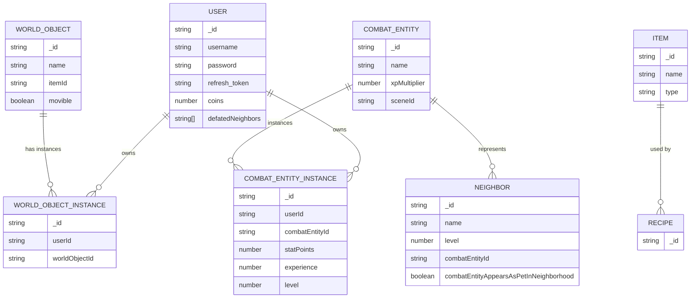
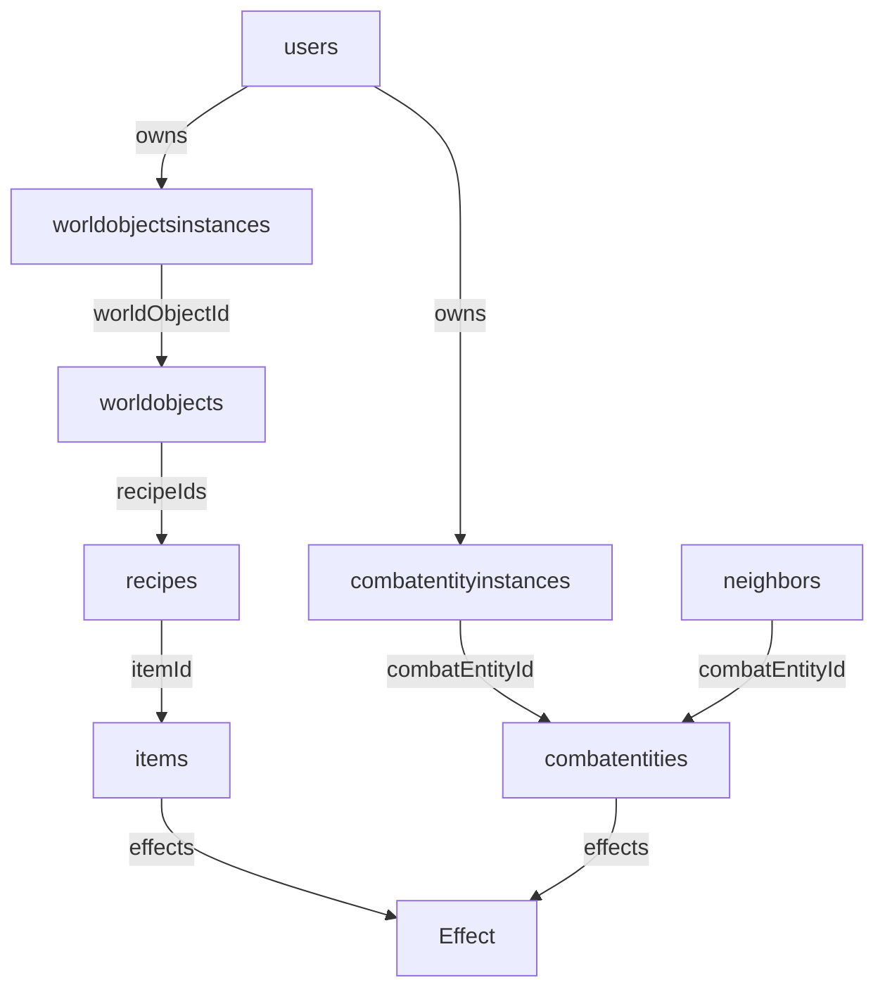
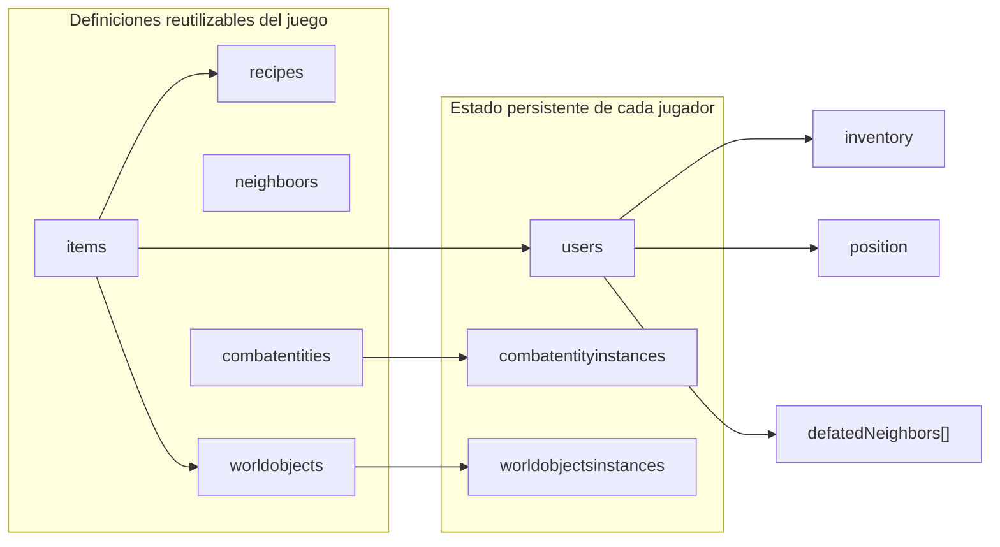

# Database

## Overview

CorralWars utiliza **MongoDB** como base de datos no relacional y **Mongoose** como ODM mediante NestJS.

La base de datos se utiliza principalmente para almacenar información persistente del jugador, definiciones reutilizables del juego y el progreso de las entidades que el jugador obtiene.

La arquitectura separa las **definiciones estáticas** de las **instancias pertenecientes a un jugador**.

```text
Godot
  │
  │ HTTP / JSON
  ▼
NestJS API
  │
  │ Mongoose
  ▼
MongoDB
```

---

# Collections

Las principales colecciones de la base de datos son:

```text
users
items
recipes
neighbors
worldobjects
worldobjectsinstances
combatentities
combatentityinstances
```

Estas colecciones representan los documentos principales de la base de datos.

Los elementos que funcionan como subdocumentos no poseen una colección independiente.

---

# General database schema

El modelo general de la base de datos se puede representar de la siguiente manera:



> El diagrama representa las relaciones conceptuales principales. Los subdocumentos como `Inventory`, `Position`, `Effect` y las estadísticas no se muestran como colecciones independientes porque están embebidos dentro de otros documentos.

---

# Reusable subdocuments

El proyecto utiliza diferentes subdocumentos reutilizables:

```text
Position
Inventory
InventorySlot
Effect
Input
Output
CombatEntityStats
CombatEntityInstanceStats
SpecialAttackStats
```

Estos objetos representan datos que pertenecen a otro documento y no necesitan existir como documentos independientes.

Cuando corresponde, se utilizan esquemas con:

```ts
@Schema({ _id: false })
```

para evitar que MongoDB genere un `_id` independiente para cada subdocumento.

---

# Users

La colección `users` almacena la información persistente del jugador.

### Campos principales

| Campo              | Tipo      | Descripción                                          |
| ------------------ | --------- | ---------------------------------------------------- |
| `_id`              | ObjectId  | Identificador generado por MongoDB.                  |
| `username`         | String    | Nombre de usuario único.                             |
| `password`         | String    | Contraseña almacenada mediante hash.                 |
| `refresh_token`    | String    | Hash del Refresh Token utilizado para autenticación. |
| `coins`            | Number    | Cantidad de monedas del jugador.                     |
| `position`         | Position  | Posición persistente del jugador.                    |
| `inventory`        | Inventory | Inventario del jugador.                              |
| `defatedNeighbors` | String[]  | Identificadores de vecinos derrotados.               |

Ejemplo conceptual:

```json
{
  "_id": "ObjectId(...)",
  "username": "player01",
  "password": "hashed_password",
  "refresh_token": "hashed_refresh_token",
  "coins": 500,
  "position": {
    "x": 120,
    "y": 250
  },
  "inventory": {
    "width": 7,
    "height": 5,
    "slots": []
  },
  "defatedNeighbors": []
}
```

> `defatedNeighbors` mantiene actualmente ese nombre en el código.

---

# Position

`Position` es un subdocumento reutilizable que representa una posición bidimensional.

```ts
@Schema({ _id: false })
export class Position {
  @Prop({ required: true, default: 0 })
  x!: number;

  @Prop({ required: true, default: 0 })
  y!: number;
}
```

Estructura:

```json
{
  "x": 120,
  "y": 250
}
```

No existe una colección `positions`.

La posición se almacena dentro del documento que la necesita.

Por ejemplo:

```text
User
 └── position

WorldObjectInstance
 └── position
```

Las posiciones fijas del mapa que no necesitan persistencia pueden mantenerse directamente en Godot.

---

# Inventory

El inventario es un subdocumento compuesto por dimensiones y una lista de slots.

```text
Inventory
├── width
├── height
└── slots[]
```

La configuración predeterminada es:

```text
width  = 7
height = 5
slots  = 35
```

Por lo tanto:

```text
7 × 5 = 35 slots
```

Ejemplo:

```json
{
  "width": 7,
  "height": 5,
  "slots": [
    {
      "itemId": null,
      "quantity": 0
    }
  ]
}
```

---

# InventorySlot

Cada slot representa una posición dentro del inventario.

```text
InventorySlot
├── itemId
└── quantity
```

Ejemplo:

```json
{
  "itemId": "item_id",
  "quantity": 5
}
```

Un slot vacío se representa mediante:

```json
{
  "itemId": null,
  "quantity": 0
}
```

`quantity` tiene un valor mínimo de `0`.

---

# Items

La colección `items` contiene las definiciones de los objetos disponibles en el juego.

Actualmente un `Item` contiene:

```text
Item
├── name
├── type
└── effects[]
```

Ejemplo:

```json
{
  "_id": "ObjectId(...)",
  "name": "Health Potion",
  "type": "consumable",
  "effects": [
    {
      "stat": "health",
      "operation": "add",
      "value": 100
    }
  ]
}
```

MongoDB genera automáticamente `_id`, por lo que no es necesario mantener un campo `key` adicional.

---

# Effect

`Effect` es un subdocumento común utilizado por diferentes sistemas del juego.

Actualmente puede utilizarse en:

```text
Item
 └── effects[]

CombatEntity
 └── specialAttacks[]
      └── effects[]
```

Su estructura es:

```text
Effect
├── stat
├── operation
└── value
```

Ejemplo:

```json
{
  "stat": "health",
  "operation": "add",
  "value": 100
}
```

Esto permite reutilizar el mismo modelo de efecto en diferentes dominios.

---

# Recipes

La colección `recipes` almacena las recetas de fabricación.

Una receta contiene:

```text
Recipe
├── inputs[]
└── outPut
```

Los elementos `Input` y `Output` son subdocumentos.

---

## Input

Cada entrada indica qué objeto y cantidad son necesarios para fabricar una receta.

```text
Input
├── itemId
├── slot
└── quantity
```

Ejemplo:

```json
{
  "itemId": "wood_id",
  "slot": "material",
  "quantity": 5
}
```

---

## Output

Indica el objeto producido por la receta.

```text
Output
├── itemId
└── quantity
```

Ejemplo:

```json
{
  "itemId": "sword_id",
  "quantity": 1
}
```

---

# Neighbors

La colección `neighbors` representa a los vecinos disponibles dentro del juego.

Un vecino puede estar asociado a una entidad de combate mediante `combatEntityId`.

Estructura:

```text
Neighbor
├── name
├── level
├── combatEntityId
└── combatEntityAppearsAsPetInNeighborhood
```

Ejemplo:

```json
{
  "_id": "ObjectId(...)",
  "name": "Balthazar",
  "level": 5,
  "combatEntityId": "griffin_id",
  "combatEntityAppearsAsPetInNeighborhood": true
}
```

La relación principal es:

```text
Neighbor
      │
      │ combatEntityId
      ▼
CombatEntity
```

Esto permite que el vecino utilice una entidad de combate sin duplicar su definición.

---

# CombatEntities

La colección `combatentities` contiene las definiciones base de las entidades que pueden participar en combate.

Una `CombatEntity` puede representar:

```text
Mascota
Vecino
Jefe
Otra entidad combatible
```

No existe una colección independiente para cada uno de estos tipos.

La entidad contiene información reutilizable y estática.

```text
CombatEntity
├── name
├── xpMultiplier
├── sceneId
├── baseStats
└── specialAttacks[]
```

---

# CombatEntityStats

`CombatEntityStats` contiene las estadísticas base de una `CombatEntity`.

```text
CombatEntityStats
├── health
├── attack
├── defense
├── velocity
├── stamina
└── specialChance
```

Restricciones actuales:

| Campo           | Mínimo |
| --------------- | -----: |
| `health`        |   1000 |
| `attack`        |     10 |
| `defense`       |      0 |
| `velocity`      |    300 |
| `stamina`       |     30 |
| `specialChance` |    0.2 |

Ejemplo:

```json
{
  "health": 1000,
  "attack": 10,
  "defense": 0,
  "velocity": 300,
  "stamina": 30,
  "specialChance": 0.2
}
```

Estas estadísticas representan los valores base de la entidad.

---

# SpecialAttackStats

`SpecialAttackStats` contiene valores utilizados para modificar las características de un ataque especial.

Actualmente contiene:

```text
SpecialAttackStats
├── velocityMultiply
└── attackMultiply
```

Ejemplo:

```json
{
  "velocityMultiply": 1.5,
  "attackMultiply": 2
}
```

Los ataques especiales pueden utilizar además:

```text
effects[]
```

que utilizan el subdocumento común `Effect`.

---

# CombatEntityInstances

La colección `combatentityinstances` representa una instancia concreta de una `CombatEntity` perteneciente a un jugador.

```text
CombatEntityInstance
├── userId
├── combatEntityId
├── combatEntityStats
├── statPoints
├── experience
└── level
```

La separación permite que diferentes usuarios posean la misma entidad con diferente progreso.

Ejemplo:

```text
CombatEntity
└── Griffin
      │
      ├── Instance del jugador A
      │      ├── level: 10
      │      └── attack: 50
      │
      └── Instance del jugador B
             ├── level: 3
             └── attack: 30
```

---

# CombatEntityInstanceStats

`CombatEntityInstanceStats` contiene las estadísticas personalizadas de una instancia.

```text
CombatEntityInstanceStats
├── health
├── attack
├── defense
├── velocity
└── stamina
```

Todas las estadísticas tienen un mínimo de `0`.

La diferencia entre ambos esquemas es:

```text
CombatEntity
└── CombatEntityStats
      ↓
   Valores base


CombatEntityInstance
└── CombatEntityInstanceStats
      ↓
   Valores personalizados
```

Esto permite modificar una instancia sin modificar la definición global de la entidad.

---

# StatPoints

`statPoints` representa los puntos de estadísticas disponibles para una instancia.

Estos puntos pertenecen a `CombatEntityInstance`, porque forman parte del progreso individual de la entidad.

Ejemplo:

```text
Nivel 4
   │
   │ subida de nivel
   ▼
+3 statPoints
   │
   ├── +2 attack
   └── +1 defense
```

Después de distribuirlos:

```text
statPoints = 0
```

De esta manera, cada instancia puede desarrollar estadísticas diferentes aunque utilice la misma definición de `CombatEntity`.

---

# Experience and Level

Cada instancia mantiene:

```text
experience
level
statPoints
```

Esto permite una progresión independiente.

Por ejemplo:

```text
Griffin
   │
   ├── Player A
   │      level: 10
   │      experience: 500
   │
   └── Player B
          level: 3
          experience: 120
```

La definición `CombatEntity` contiene `xpMultiplier`, que puede utilizarse para controlar la dificultad de progresión de cada entidad.

Conceptualmente:

```text
XP requerida =
XP base × xpMultiplier × fórmula(nivel)
```

Una fórmula posible:

```gdscript
func get_xp_required(level: int, xp_multiplier: float) -> int:
    var base_xp := 100.0
    var exponent := 1.5

    return int(
        base_xp *
        xp_multiplier *
        pow(level, exponent)
    )
```

La fórmula anterior representa una regla de gameplay y no implica que deba ejecutarse dentro de MongoDB.

---

# CombatEntity and Godot Scene

Cada `CombatEntity` puede tener un identificador lógico:

```text
sceneId
```

Ejemplo:

```json
{
  "sceneId": "griffin"
}
```

Godot puede encargarse de asociar ese identificador con una escena concreta:

```text
griffin
   │
   ▼
res://entities/combat/griffin.tscn
```

De esta manera la base de datos no depende de las rutas internas del proyecto de Godot.

---

# Combat flow

El flujo entre un jugador, un vecino y su entidad de combate es:

```text
Player
  │
  ▼
Neighbor
  │
  │ combatEntityId
  ▼
CombatEntity
  │
  │ sceneId
  ▼
Godot
  │
  ▼
Escena .tscn
```

Si el jugador posee una instancia de esa entidad:

```text
User
   │
   ▼
CombatEntityInstance
   │
   ├── level
   ├── experience
   ├── statPoints
   └── combatEntityStats
          │
          ▼
        Godot
```

---

# WorldObjects

La colección `worldobjects` representa las definiciones de los objetos interactuables del mundo.

La definición contiene información reutilizable.

Conceptualmente:

```text
WorldObject
├── name
├── itemId
├── movible
└── recipeIds[]
```

Las recetas pueden relacionarse mediante sus identificadores.

```text
WorldObject
   │
   │ recipeIds
   ▼
Recipe
```

Las posiciones que forman parte fija del diseño del mapa pueden mantenerse en Godot cuando no necesitan persistencia.

---

# WorldObjectInstances

La colección `worldobjectsinstances` representa una instancia concreta de un objeto del mundo asociada a un jugador.

Conceptualmente:

```text
WorldObjectInstance
├── userId
├── worldObjectId
├── position
└── inventory
```

La separación permite:

```text
WorldObject
    ↓
Definición reutilizable

WorldObjectInstance
    ↓
Estado específico
```

Por ejemplo:

```text
WorldObject
└── Chest
      │
      ├── Player A
      │     └── inventory
      │
      └── Player B
            └── inventory
```

---

# Definition vs Instance

Uno de los principios principales del diseño es separar las definiciones de las instancias.

## Definiciones

Contienen información reutilizable:

```text
CombatEntity
Item
Recipe
Neighbor
WorldObject
```

## Instancias

Contienen información específica de un usuario:

```text
CombatEntityInstance
WorldObjectInstance
```

Esto evita duplicar información estática.

---

# Database responsibilities

MongoDB almacena información que necesita persistencia:

```text
Users
Inventories
Coins
Progress
Experience
Levels
StatPoints
CombatEntityInstanceStats
Entities obtained by players
Persistent WorldObject instances
Recipes
Items
CombatEntity definitions
WorldObject definitions
Neighbors
```

Godot administra principalmente información temporal:

```text
Movimiento
IA
Animaciones
Colisiones
Física
Cooldowns
Ataques activos
Vida temporal durante el combate
Efectos visuales
Posiciones fijas del mapa
```

Por ejemplo:

```text
CombatEntityInstance
└── health = 1200
```

puede representar una estadística persistente.

Mientras que:

```text
health actual durante el combate = 650
```

puede mantenerse únicamente en Godot mientras la batalla está activa.

---

# Identifiers

MongoDB utiliza `_id` como identificador de los documentos.

No se utiliza un campo adicional `key`.

Las relaciones se realizan mediante identificadores:

```text
Neighbor
└── combatEntityId
       │
       ▼
CombatEntity._id
```

```text
CombatEntityInstance
├── userId
│     └── User._id
│
└── combatEntityId
      └── CombatEntity._id
```

```text
WorldObjectInstance
├── userId
│     └── User._id
│
└── worldObjectId
      └── WorldObject._id
```

Los campos de referencia utilizados actualmente se manejan como `string` en los schemas correspondientes.

---

# Database relationship diagram



---

# Subdocument structure

Los principales subdocumentos utilizados por el sistema son:

```text
User
├── Position
└── Inventory
    └── InventorySlot

Item
└── Effect[]

Recipe
├── Input[]
└── Output

CombatEntity
├── CombatEntityStats
└── SpecialAttackStats

CombatEntityInstance
└── CombatEntityInstanceStats

WorldObjectInstance
├── Position
└── Inventory
    └── InventorySlot
```

---

# Summary

La base de datos se organiza alrededor de las siguientes colecciones:

```text
users
items
recipes
neighbors
worldobjects
worldobjectsinstances
combatentities
combatentityinstances
```

Los conceptos principales son:

```text
┌─────────────────────────────────────────┐
│              DEFINICIONES               │
├─────────────────────────────────────────┤
│ CombatEntity                            │
│ Item                                     │
│ Recipe                                   │
│ Neighbor                                 │
│ WorldObject                              │
└─────────────────────────────────────────┘

                    │
                    │ referencias
                    ▼

┌─────────────────────────────────────────┐
│               INSTANCIAS                │
├─────────────────────────────────────────┤
│ CombatEntityInstance                    │
│ WorldObjectInstance                     │
└─────────────────────────────────────────┘
```

Las entidades de combate utilizan:

```text
CombatEntity
├── CombatEntityStats
├── SpecialAttackStats
└── sceneId
```

=======

# Diagrama general

```text
MongoDB
├── users
│   ├── username
│   ├── password
│   ├── refresh_token
│   ├── coins
│   ├── position
│   │   ├── x
│   │   └── y
│   ├── inventory
│   │   ├── width
│   │   ├── height
│   │   └── slots[]
│   │       ├── itemId
│   │       └── quantity
│   ├── defatedNeighbors[]
│   ├── activatedPetId
│   ├── activatedSkin
│   └── timestamps (createdAt, updatedAt)
│
├── items
│   ├── name
│   ├── type
│   └── effects[]
│       ├── stat
│       ├── operation
│       └── value
│
├── recipes
│   ├── inputs[]
│   │   ├── itemId
│   │   ├── slot
│   │   └── quantity
│   └── outPut
│       ├── itemId
│       └── quantity
│
├── neighboors
│   ├── name
│   ├── level
│   ├── combatEntityId
│   ├── combatScene
│   └── combatEntityAppearsAsPetInNeighborhood
│
├── worldobjects
│   ├── itemId
│   ├── position
│   │   ├── x
│   │   └── y
│   ├── movible
│   └── recipes[]
│       ├── inputs[]
│       │   ├── itemId
│       │   ├── slot
│       │   └── quantity
│       └── outPut
│           ├── itemId
│           └── quantity
│
├── combatentities
│   ├── name
│   ├── stats
│   │   ├── health
│   │   ├── attack
│   │   ├── defense
│   │   ├── velocity
│   │   ├── stamina
│   │   └── specialChance
│   └── specialAttacks[]
│       ├── name
│       ├── effects[]
│       │   ├── stat
│       │   ├── operation
│       │   └── value
│       └── specialAttackStats
│           ├── velocityMultiply
│           └── attackMultiply
│
├── combatentityinstances
│   ├── userId
│   ├── combatEntityId
│   ├── combatEntityStats
│   │   ├── health
│   │   ├── attack
│   │   ├── defense
│   │   ├── velocity
│   │   └── stamina
│   ├── statPoints
│   ├── experience
│   ├── level
│   └── timestamps (createdAt, updatedAt)
│
└── worldobjectsinstances
    ├── userId
    ├── worldObjectId
    ├── position
    │   ├── x
    │   └── y
    └── inventory
        ├── width
        ├── height
        └── slots[]
            ├── itemId
            └── quantity
```

Este diagrama refleja la estructura real de los schemas actuales en `src/*`: las colecciones principales y los subdocumentos que definen sus propiedades, sin incluir campos heredados por Mongoose ni nombres obsoletos del documento anterior.

## Vista en Mermaid

```mermaid
flowchart TD
    MongoDB["MongoDB"]

    MongoDB --> Users["users"]
    Users --> U1["username"]
    Users --> U2["password"]
    Users --> U3["refresh_token"]
    Users --> U4["coins"]
    Users --> U5["position"]
    U5 --> U5a["x"]
    U5 --> U5b["y"]
    Users --> U6["inventory"]
    U6 --> U6a["width"]
    U6 --> U6b["height"]
    U6 --> U6c["slots[]"]
    U6c --> U6c1["itemId"]
    U6c --> U6c2["quantity"]
    Users --> U7["defatedNeighbors[]"]
    Users --> U8["activatedPetId"]
    Users --> U9["activatedSkin"]
    Users --> U10["timestamps"]

    MongoDB --> Items["items"]
    Items --> I1["name"]
    Items --> I2["type"]
    Items --> I3["effects[]"]
    I3 --> I3a["stat"]
    I3 --> I3b["operation"]
    I3 --> I3c["value"]

    MongoDB --> Recipes["recipes"]
    Recipes --> R1["inputs[]"]
    R1 --> R1a["itemId"]
    R1 --> R1b["slot"]
    R1 --> R1c["quantity"]
    Recipes --> R2["outPut"]
    R2 --> R2a["itemId"]
    R2 --> R2b["quantity"]

    MongoDB --> Neighbors["neighboors"]
    Neighbors --> N1["name"]
    Neighbors --> N2["level"]
    Neighbors --> N3["combatEntityId"]
    Neighbors --> N4["combatScene"]
    Neighbors --> N5["combatEntityAppearsAsPetInNeighborhood"]

    MongoDB --> WorldObjects["worldobjects"]
    WorldObjects --> W1["itemId"]
    WorldObjects --> W2["position"]
    W2 --> W2a["x"]
    W2 --> W2b["y"]
    WorldObjects --> W3["movible"]
    WorldObjects --> W4["recipes[]"]
    W4 --> W4a["inputs[]"]
    W4a --> W4a1["itemId"]
    W4a --> W4a2["slot"]
    W4a --> W4a3["quantity"]
    W4 --> W4b["outPut"]
    W4b --> W4b1["itemId"]
    W4b --> W4b2["quantity"]

    MongoDB --> CombatEntities["combatentities"]
    CombatEntities --> C1["name"]
    CombatEntities --> C2["stats"]
    C2 --> C2a["health"]
    C2 --> C2b["attack"]
    C2 --> C2c["defense"]
    C2 --> C2d["velocity"]
    C2 --> C2e["stamina"]
    C2 --> C2f["specialChance"]
    CombatEntities --> C3["specialAttacks[]"]
    C3 --> C3a["name"]
    C3 --> C3b["effects[]"]
    C3b --> C3b1["stat"]
    C3b --> C3b2["operation"]
    C3b --> C3b3["value"]
    C3 --> C3c["specialAttackStats"]
    C3c --> C3c1["velocityMultiply"]
    C3c --> C3c2["attackMultiply"]

    MongoDB --> CombatEntityInstances["combatentityinstances"]
    CombatEntityInstances --> CI1["userId"]
    CombatEntityInstances --> CI2["combatEntityId"]
    CombatEntityInstances --> CI3["combatEntityStats"]
    CI3 --> CI3a["health"]
    CI3 --> CI3b["attack"]
    CI3 --> CI3c["defense"]
    CI3 --> CI3d["velocity"]
    CI3 --> CI3e["stamina"]
    CombatEntityInstances --> CI4["statPoints"]
    CombatEntityInstances --> CI5["experience"]
    CombatEntityInstances --> CI6["level"]
    CombatEntityInstances --> CI7["timestamps"]

    MongoDB --> WorldObjectInstances["worldobjectsinstances"]
    WorldObjectInstances --> WI1["userId"]
    WorldObjectInstances --> WI2["worldObjectId"]
    WorldObjectInstances --> WI3["position"]
    WI3 --> WI3a["x"]
    WI3 --> WI3b["y"]
    WorldObjectInstances --> WI4["inventory"]
    WI4 --> WI4a["width"]
    WI4 --> WI4b["height"]
    WI4 --> WI4c["slots[]"]
    WI4c --> WI4c1["itemId"]
    WI4c --> WI4c2["quantity"]
```





